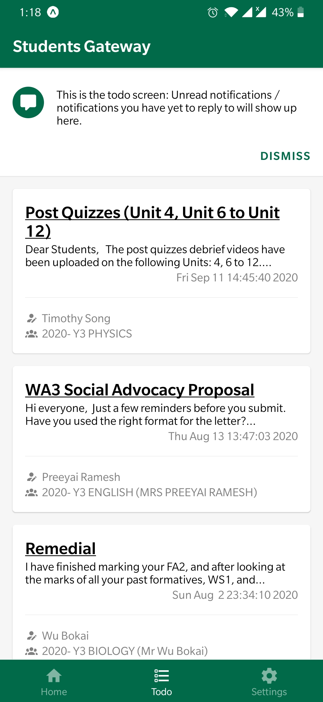
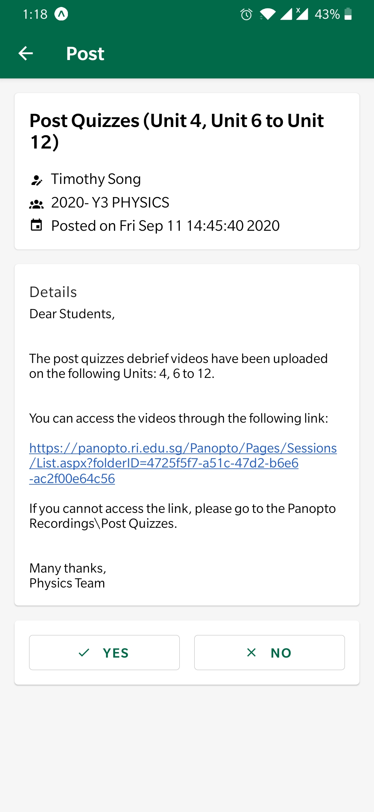

# 🎓 Students Gateway (App) — Y3 CEP Final Project

[ [Website/API](https://github.com/SoInstant/students-gateway) | App ]

Students' Gateway enables teachers to interact with students more conveniently on administrative matters.

## 📷 Screenshots

| Todo screen | Post view |
|-|-|
|  |  |

## 🚀 Features

- View announcements from teachers
- Provide responses to teachers regarding announcements
- Manage pending tasks in the Todo tab

## ⛏️ Installation

### For development

1. Install [Node.js](https://nodejs.org/en/)
2. Clone the repository
3. `npm install -g expo-cli`
4. In the repository, `npm install`
5. Install the Expo app on your device ([iOS](https://apps.apple.com/us/app/expo-client/id982107779), [Android](https://play.google.com/store/apps/details?id=host.exp.exponent))

Then, run `npm start` and follow the instructions

### Ready made

[Browser simulator](https://expo.io/appetize-simulator?url=https://expo.io/@ycmelon/students-gateway) / [Expo project](https://expo.io/@ycmelon/students-gateway)

## 📃  License

[GNU General Public License v3.0](https://choosealicense.com/licenses/gpl-3.0/)
